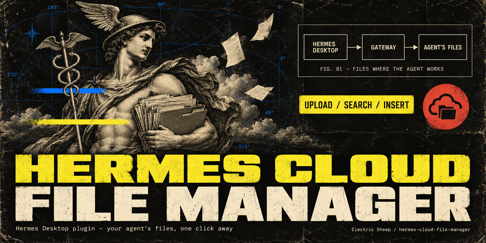
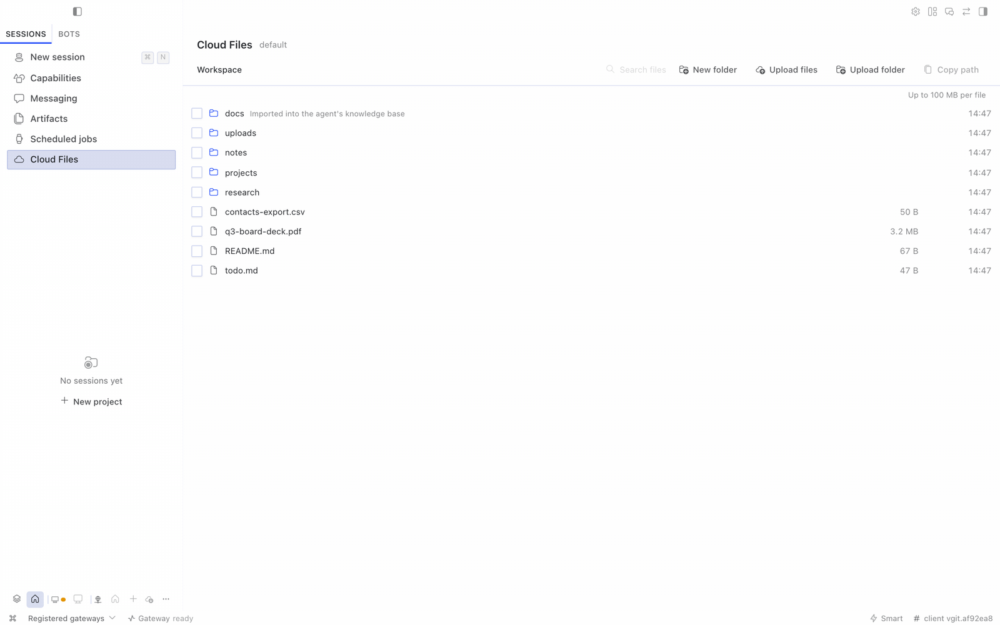
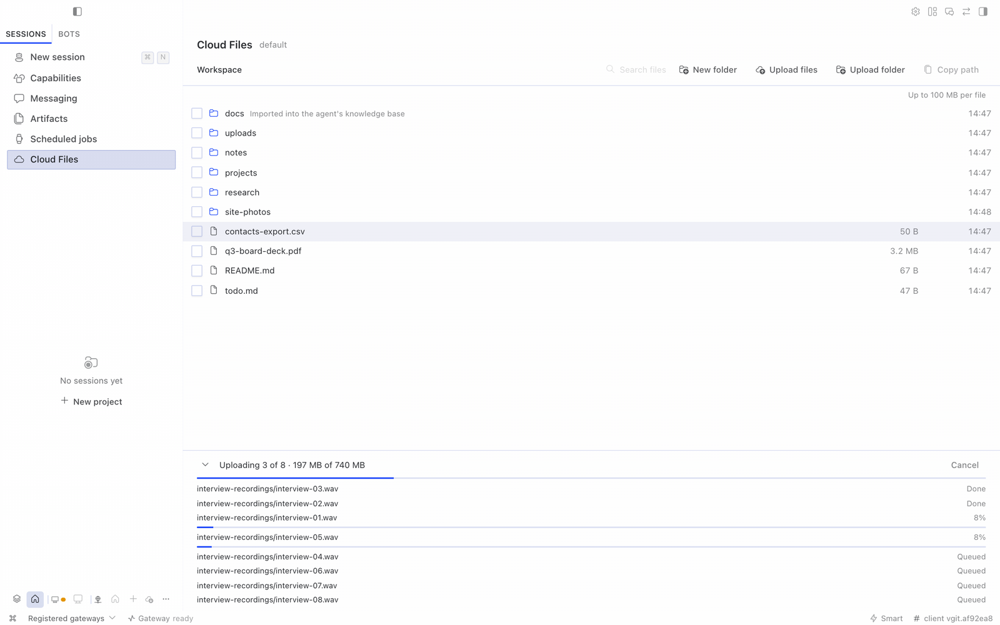
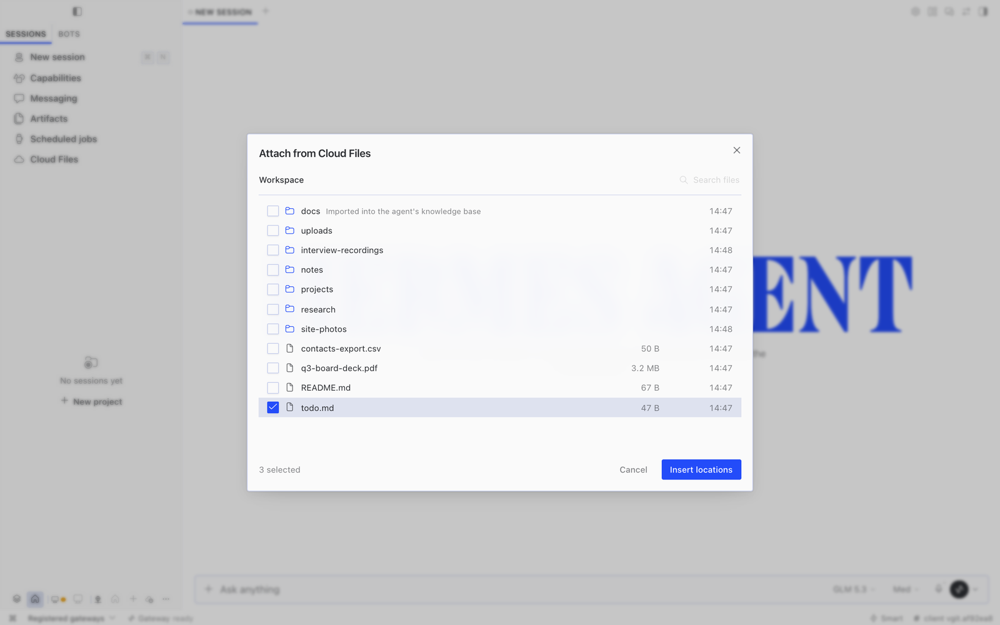
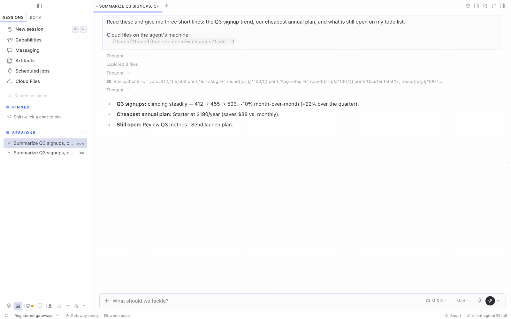

# Cloud File Manager for Hermes



When your Hermes agent runs somewhere else — a VPS, a home server, a hosted agent — its files live on that
machine, not yours. Cloud File Manager puts that machine's files one click away in Hermes Desktop.

- **Cloud Files** in the sidebar: browse the agent's folders, search by name, create folders, and upload files
  or whole folders by drag-and-drop or from the toolbar. Folder structure is kept, large files go up in chunks
  (a brief network drop is retried automatically; a file that still fails gets a **Retry** button), and nothing
  is ever overwritten — a name clash keeps both files.
- **Cloud** in the chat **+** menu: pick files already on the agent's machine and drop their locations into your
  message. Nothing is uploaded again and nothing is copied into the chat; the agent opens the files where they
  are with its own tools.





## Requirements

- Hermes Desktop **0.21.1 or newer**, connected to an agent (local, remote with a token, or remote with sign-in).
- The agent's terminal runs **locally on the gateway machine** (`terminal.backend: local`, the default). Agents
  that run their tools in Docker, over SSH or in another sandbox see a different filesystem; the tab says so
  instead of showing the wrong files.

## Install

Cloud File Manager has two halves in one package: a small API that runs **on the agent's gateway** and the
screens that run **in Hermes Desktop**.

**From Hermes Desktop (recommended):**

1. Open **Capabilities → Plugins → Install from Git**, enter
   `https://github.com/electricsheephq/hermes-cloud-file-manager`, choose **Review repository**, then **Install**.
   Desktop installs the agent half into the connected agent and the desktop half on this computer.
2. **Restart the agent's gateway** once. Hermes mounts plugin APIs only at startup.
3. In **Capabilities → Plugins**, open **Cloud File Manager** and switch on **Desktop**. Desktop plugins stay off
   until you turn them on.

The **Cloud Files** row appears in the sidebar, and **Cloud** appears in the chat **+** menu.

**From the command line on the gateway machine:**

```bash
hermes plugins install electricsheephq/hermes-cloud-file-manager --no-enable
hermes plugins enable hermes-cloud-file-manager
# restart the gateway (or your hermes dashboard service) so the API is mounted
```

Then add the desktop half on each computer that uses it: **Capabilities → Plugins → Install from Git** with the
same repository, and switch on **Desktop** on the plugin's card.

The sidebar row and the **+ → Cloud** entry only appear for agents that have the gateway half enabled, so
installing the desktop half is harmless for your other agents.

## Using it

- **Upload:** drag files or folders anywhere onto the Cloud Files page, or use **Upload files** /
  **Upload folder**. Progress, retries and failures show in the drawer at the bottom; the batch keeps going if
  you leave the page. Switching to another agent mid-upload pauses the batch until you switch back — files never
  land on the wrong machine.
- **Find:** type in **Search files** (name contains, or a glob such as `*.pdf`).
- **Share with the agent:** select files and **Copy path**, or in any chat press **+ → Cloud**, tick files in
  any folders, and **Insert locations**. The message gets a short list of absolute paths the agent can open.





## Settings

All optional, under `plugins.entries.hermes-cloud-file-manager.settings` in the agent's `config.yaml`:

| Setting | Default | Meaning |
|---|---|---|
| `roots` | `[]` | Folders to show. Empty means the agent's own working folder (`terminal.cwd`), else the gateway user's home. |
| `folder_notes` | `{}` | A short note per top-level folder, e.g. `{docs: "Imported into the agent's knowledge base"}`. |
| `max_file_mb` | `100` | Largest single file accepted. Bigger files are refused before anything is sent. |

## Security model

- The plugin adds **no login, tokens or permission layer** of its own. Desktop reaches it through the gateway's
  existing authenticated plugin channel, so it is exactly as private as your gateway.
- Every path is confined to the configured folders.
  - Names are checked for traversal and non-portable characters.
  - Symlinks that point outside the shown folders are not followed. An upload never writes its final file
    through a link.
  - A listing may show such a link as not openable, with the link's own size and date; the plugin never opens
    or stats its target.
  - **The agent's Hermes home (its settings and API keys) can never be listed or written**, even when it sits
    inside a shown folder. The exception is a folder inside it that the agent is set up to work in (`roots`,
    `terminal.cwd`, or the Docker `workspace/` folder); see [SECURITY.md](SECURITY.md).
  - When the shown folder is the gateway user's home, hidden top-level entries (`.ssh`, `.config`, …)
    are hidden and refused.
- Uploads never overwrite, rename or delete existing files. There is no delete in this version. (Stale temporary
  files with the plugin's reserved `.cfm-…part` name are cleaned up after 24 hours.)
- Everyone who can use the agent can see its files — the same access the agent itself has.

Found a security problem? See [SECURITY.md](SECURITY.md).

## Limits in this version

- No rename, move, delete or overwrite (coming later; use the agent or a shell for now).
- **Upload folder** cannot carry empty folders (a browser limitation); drag-and-drop keeps them.
- A folder with more than 500 items shows the first 500; use **Search files** to find the rest.
- Agents whose tools run in Docker, over SSH or in another sandbox are not supported yet.

## Compatibility

Requires Hermes and Hermes Desktop **0.21.1 or newer** (`requires_hermes: ">=0.21.1"`). CI checks every change
against pinned builds of upstream [Hermes Agent](https://github.com/NousResearch/hermes-agent) and one downstream
Desktop fork (see `HERMES_*_SHA` in `.github/workflows/ci.yml`). Those pins are bumped deliberately, after the
suite passes against the new builds.

## Uninstall

Open **Cloud File Manager** in **Capabilities → Plugins** and choose **Uninstall**. Or run
`hermes plugins remove hermes-cloud-file-manager` on the gateway machine, then restart the gateway.

On every other computer where you added the desktop half, also remove it there with **Uninstall**. Uploaded files
stay where they are.

## Development

```bash
npm ci && npm run build && npm test && npm run typecheck   # desktop half
python -m pytest                                           # gateway half (needs fastapi, httpx, pytest)
```

`desktop/plugin.js` is generated from `src/desktop/` by `npm run build` and committed; CI fails if it is stale,
if it imports anything but the plugin SDK and React, or if either pinned Hermes Desktop loader would refuse it.

## License

MIT © Electric Sheep
