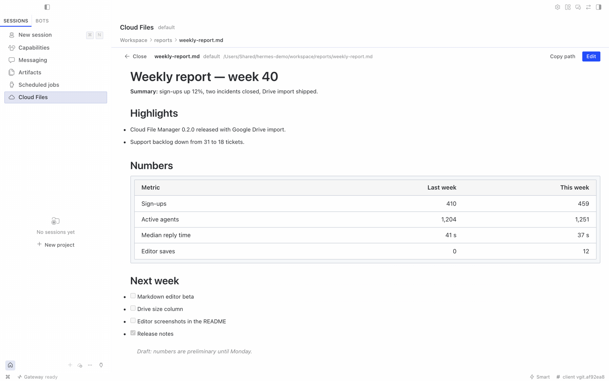
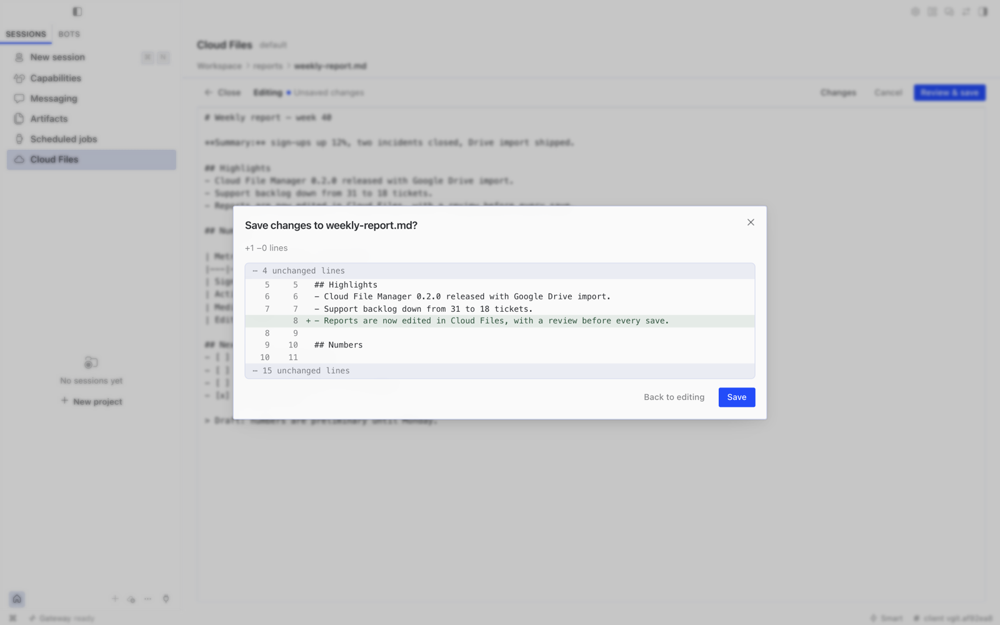
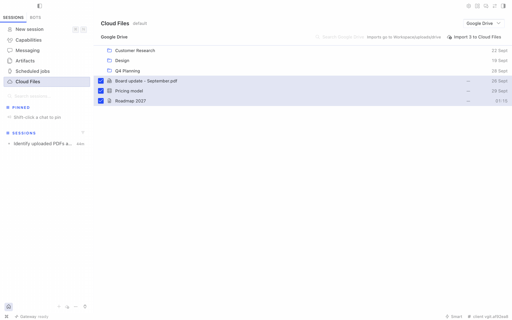
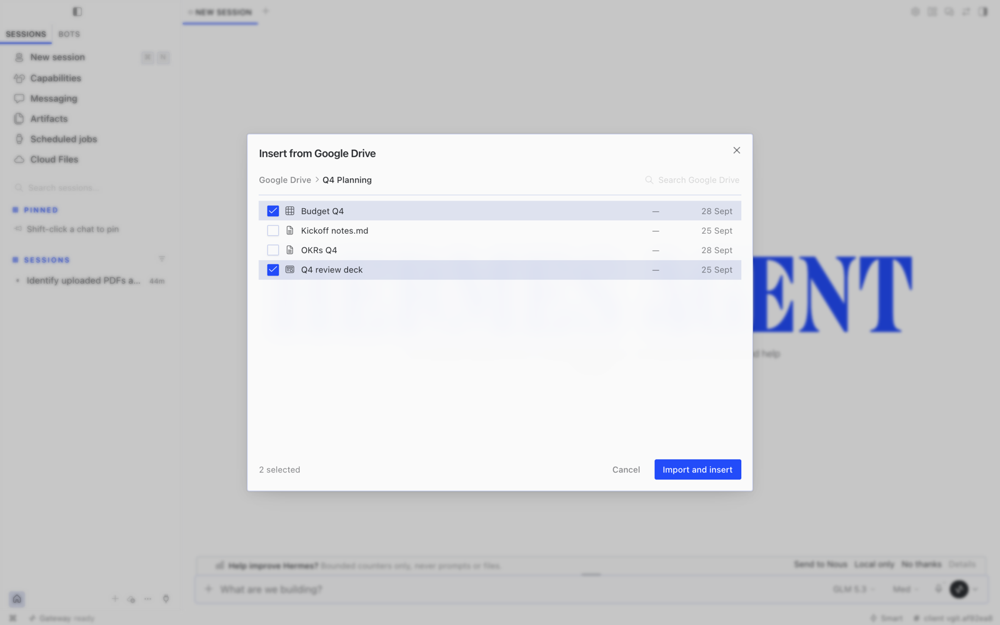

# Cloud File Manager for Hermes


When your Hermes agent runs somewhere else — a VPS, a home server, a hosted agent — its files live on that
machine, not yours. Cloud File Manager puts that machine's files one click away in Hermes Desktop.

- **Cloud Files** in the sidebar: browse the agent's folders, search by name, create folders, and upload files
  or whole folders by drag-and-drop or from the toolbar. Folder structure is kept, large files go up in chunks
  (a brief network drop is retried automatically; a file that still fails gets a **Retry** button), and uploads
  never overwrite — a name clash keeps both files.
- **Open and edit** Markdown and text files: view first, edit on purpose, review the changes, then save.
  Nothing is saved until you choose Save.
- **Cloud** in the chat **+** menu: pick files already on the agent's machine and drop their locations into your
  message. Nothing is uploaded again and nothing is copied into the chat; the agent opens the files where they
  are with its own tools.
- **Google Drive** (optional): if the agent is signed in to Google through its `google-workspace` skill, browse
  and search its Drive and import files onto the agent's machine, from the page or from **+ → Google Drive**.


## Requirements

- Hermes Desktop **0.21.1 or newer**, connected to an agent (local, remote with a token, or remote with sign-in).
- The agent's terminal runs **locally on the gateway machine** (`terminal.backend: local`, the default). Agents
  that run their tools in Docker, over SSH or in another sandbox see a different filesystem; the tab says so
  instead of showing the wrong files.

## Install

Cloud File Manager has two halves in one package: a small API that runs **on the agent's gateway** and the
screens that run **in Hermes Desktop**.

**From Hermes Desktop (recommended):**

1. Open **Capabilities → Plugins → Install from Git**, enter
   `https://github.com/electricsheephq/hermes-cloud-file-manager`, choose **Review repository**, then **Install**.
   Desktop installs the agent half into the connected agent and the desktop half on this computer.
2. **Restart the agent's gateway** once. Hermes mounts plugin APIs only at startup.
3. In **Capabilities → Plugins**, open **Cloud File Manager** and switch on **Desktop**. Desktop plugins stay off
   until you turn them on.

The **Cloud Files** row appears in the sidebar, and **Cloud** appears in the chat **+** menu.

**From the command line on the gateway machine:**

```bash
hermes plugins install electricsheephq/hermes-cloud-file-manager --no-enable
hermes plugins enable hermes-cloud-file-manager
# restart the gateway (or your hermes dashboard service) so the API is mounted
```

Then add the desktop half on each computer that uses it: **Capabilities → Plugins → Install from Git** with the
same repository, and switch on **Desktop** on the plugin's card.

The sidebar row and the **+ → Cloud** entry only appear for agents that have the gateway half enabled, so
installing the desktop half is harmless for your other agents.

## Using it

- **Upload:** drag files or folders anywhere onto the Cloud Files page, or use **Upload files** /
  **Upload folder**. Progress, retries and failures show in the drawer at the bottom; the batch keeps going if
  you leave the page. Switching to another agent mid-upload pauses the batch until you switch back — files never
  land on the wrong machine.
- **Find:** type in **Search files** (name contains, or a glob such as `*.pdf`).
- **Read and edit Markdown:** double-click a `.md`, `.markdown` or `.txt` file (or select it and choose
  **Open**). It opens read-only, rendered like chat. Choose **Edit** to change the source, **Changes** to see
  your edits line by line, and **Review & save** to check the diff before **Save**. Nothing is written until you
  press Save in that review:
  - no autosave, and ⌘S only opens the review;
  - closing or moving away with unsaved edits asks first;
  - if you go to another page, your unsaved draft is kept in memory until you come back. It is lost if Hermes
    quits.

  If the file changed on the agent's machine after you opened it (for example, the agent edited it), Save is
  refused. You can then compare with their version and save knowingly, or copy your text. An open file stays
  tied to the agent you opened it on; switch back to that agent to save.




- **Share with the agent:** select files and **Copy path**, or in any chat press **+ → Cloud**, tick files in
  any folders, and **Insert locations**. The message gets a short list of absolute paths the agent can open.
  If you switch chats or agents while the picker is open, it offers **Copy locations** instead of inserting, so
  locations don't land in a chat you switched to.


## Google Drive (optional)

If the agent can already use Google Drive through its `google-workspace` skill, Cloud File Manager can bring
files from that Drive onto the agent's machine:

- **On the Cloud Files page:** choose **Google Drive** in the folder menu. Browse or search the agent's Drive,
  tick files, and choose **Import to Cloud Files**.
- **In a chat:** choose **+ → Google Drive**, tick files, and choose **Import and insert**. The files are
  imported, then their locations go into your message, exactly like **+ → Cloud**.





Imports land in `uploads/drive/` in the first shown folder, one file at a time. Google Docs and Slides arrive as
PDF, Sheets as CSV and Drawings as PNG; other files arrive as they are. A name clash keeps both files, and
`max_file_mb` applies.

**Setup:** sign the agent in to Google through its `google-workspace` skill, with Drive access. Follow the
skill's own setup, or ask the agent to do it. Within about a minute, **Google Drive** appears for that agent.
For agents without it, nothing extra is shown.

**What it can and can't do:**
- It is read-only toward Google Drive. It only lists, searches and downloads; it never uploads, edits, shares or
  deletes anything there.
- It works through the agent's own skill. Cloud File Manager never reads the Google token and never installs
  anything.
- It uses the Google account the agent is signed in to, so whoever can use the agent can import from that Drive.

## Settings

All optional, under `plugins.entries.hermes-cloud-file-manager.settings` in the agent's `config.yaml`:

| Setting | Default | Meaning |
|---|---|---|
| `roots` | `[]` | Folders to show. Empty means the agent's own working folder (`terminal.cwd`), else the gateway user's home. |
| `folder_notes` | `{}` | A short note per top-level folder, e.g. `{docs: "Imported into the agent's knowledge base"}`. |
| `max_file_mb` | `100` | Largest single file accepted. Bigger files are refused before anything is sent. |

## Security model

- The plugin adds **no login, tokens or permission layer** of its own. Desktop reaches it through the gateway's
  existing authenticated plugin channel, so it is exactly as private as your gateway.
- Every path is confined to the configured folders.
  - Names are checked for traversal and non-portable characters.
  - Symlinks that point outside the shown folders are not followed. An upload never writes its final file
    through a link.
  - A listing may show such a link as not openable, with the link's own size and date. The plugin never opens
    its target or shows the target's size or date; it only checks where the link points.
  - **The agent's Hermes home (its settings and API keys) can never be listed, read or written**, even when it sits
    inside a shown folder. The exception is a folder inside it that the agent is set up to work in (`roots`,
    `terminal.cwd`, or the Docker `workspace/` folder); see [SECURITY.md](SECURITY.md).
  - When the shown folder is the gateway user's home, hidden top-level entries (`.ssh`, `.config`, …)
    are hidden and refused.
- Uploads never overwrite, rename or delete existing files. There is no delete in this version. (Stale temporary
  files with the plugin's reserved `.cfm-…part` name are cleaned up after 24 hours.)
- Only Save in the editor overwrites, only the file you opened, and only if it has not changed since you opened
  it. See [SECURITY.md](SECURITY.md) for the accepted race with writers outside this process.
- Everyone who can use the agent can see its files — the same access the agent itself has.

Found a security problem? See [SECURITY.md](SECURITY.md).

## Limits in this version

- No rename, move or delete (coming later; use the agent or a shell for now).
- Uploads never overwrite. Only Save in the editor overwrites, only the file you opened, and only if it has not
  changed since you opened it.
- **Upload folder** cannot carry empty folders (a browser limitation); drag-and-drop keeps them.
- The editor opens `.md`, `.markdown` and `.txt` files up to 1 MB, as UTF-8. A file that mixes line endings is
  saved with CRLF throughout once edited; the review says so. Images in a rendered file load from their links,
  as in Hermes's own file preview. Unsaved drafts live in memory only and are lost when Hermes quits.
- A folder with more than 500 items shows the first 500; use **Search files** to find the rest.
- Agents whose tools run in Docker, over SSH or in another sandbox are not supported yet.
- Google Drive is import-only: pick files, not folders, and nothing is ever written back to Drive.

## Compatibility

Requires Hermes and Hermes Desktop **0.21.1 or newer** (`requires_hermes: ">=0.21.1"`). CI checks every change
against pinned builds of upstream [Hermes Agent](https://github.com/NousResearch/hermes-agent) and one downstream
Desktop fork (see `HERMES_*_SHA` in `.github/workflows/ci.yml`). Those pins are bumped deliberately, after the
suite passes against the new builds.

## Uninstall

Open **Cloud File Manager** in **Capabilities → Plugins** and choose **Uninstall**. Or run
`hermes plugins remove hermes-cloud-file-manager` on the gateway machine, then restart the gateway.

On every other computer where you added the desktop half, also remove it there with **Uninstall**. Uploaded files
stay where they are.

## Development

```bash
npm ci && npm run build && npm test && npm run typecheck   # desktop half
python -m pytest                                           # gateway half (needs fastapi, httpx, pytest)
```

`desktop/plugin.js` is generated from `src/desktop/` by `npm run build` and committed; CI fails if it is stale,
if it imports anything but the plugin SDK and React, or if either pinned Hermes Desktop loader would refuse it.

## License

MIT © Electric Sheep
